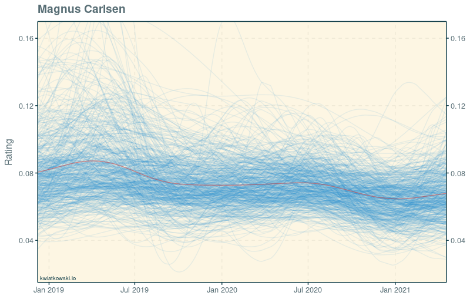
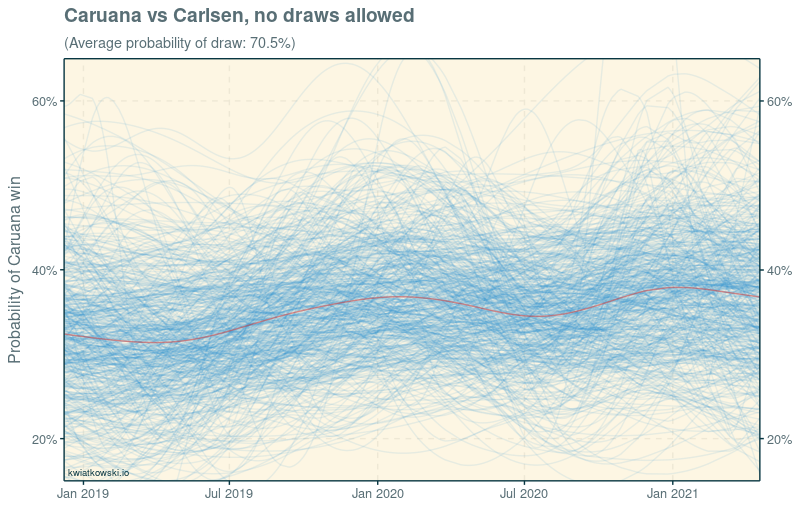
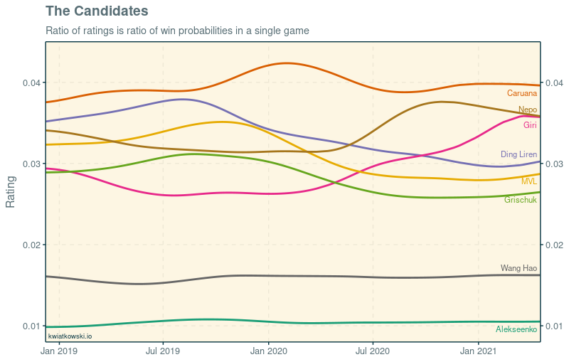

<small>
Data and code are [available on Github.](https://github.com/huffyhenry/forecasting-candidates/tree/master/2021)
</small>

It's this time of the year again. Eight of the world's most 
sartorially challenged millenials are about to reunite in Yekaterinburg
and play the second leg of the Candidates tournament. The prize is a lifetime of regret, 
to be incurred later in the year in the world championship match against
Magnus Carlsen. But who will the lucky winner be? The favourites
Fabiano Caruana and Ding Liren disappointed during the first leg
while Ian Nepomniachtchi and Maxime Vachier-Lagrave
emerged as joint leaders. And chess has since become a bona fide
e-sport, with traditional events cancelled and top players competing 
in online rapid events.

Ahead of this year's tournament, I set out to improve my old
[model of elite chess](https://kwiatkowski.io/candidates). The new version 
is still based on Davidson ratings, but with a major upgrade:
the evolution of players' strengths over time is modelled with a Gaussian
Process. Classical and rapid chess are put on an equal footing: performance
in both formats is assumed to be driven by the same underlying playing strength,
and only the baseline draw probabilities differ. The data
comprises 3617 games between top players since the 2018 Carlsen-Caruana match. 
I tried hard to strip all blitz and bullet games from the dataset and 
few, if any, slipped through.

### The model
To explain the model, let's ask it what it thinks about the world champion:

<figure>
  
</figure>

In this so-called spaghetti plot, every blue line represents one possible course of Carlsen's
playing strength over the last two and a half years. These individual 
histories may differ significantly from one another, but together they are
expected to cover the spectrum of possibilities well. 
The red line summarises them by connecting the mean of the ratings at each date. 
The story that emerges is one of a steady slump since Carlsen's arguably 
best-ever form following the match against Caruana.

One weakness of the model, shared by many rating systems, is that the
raw rating is hard to interpret. What does Carlsen's drop from 0.081 to 0.068
actually mean? We can get an insight by pitting him against his last
challenger:

<figure>
  
</figure>

Here, each line gives the probability that Caruana would win a classical
game against Carlsen if we knew that the game was not drawn. In other words,
the draw probability is discarded and the players' win probabilities are
rescaled proprtionally to sum up to 100%. It looks like
Caruana has gained some ground since the 2018 match. Some lines
even cross the 50% threshold, indicating that Caruana would be favoured to win,
although overall the model still prefers Carlsen by a comfortable margin.
But from this perspective it is not possible to tell to what extent Caruana's
upward trend is due to his own improvement and to what extent to Carlsen's slump.

### The Candidates
Let's have a look at how the eight candidates have fared according to the
model. We revert to plotting the mean rating since no suitable baseline exists:

<figure>
  
</figure>

Wang Hao and Alekseenko are clear outsiders. Caruana 
is the strongest candidate, with a fairly
stable rating apart from the bump around his dominant victory at Wijk aan Zee in 2020.
The switch to online chess was kind to Giri and Nepomniachtchi. 
Giri especially has impressed by transforming himself over the course of 2020 
from a player with a reputation for solid and deliberate style into a speed chess
juggernaut, and the model recognises it clearly. Ding Liren,
Grischuk and Vachier-Lagrave lost a lot of rating in the same period
due to relatively poor performances and inactivity.

To predict the outcome of the tournament, I took the actual results from
last year and the current ratings and simulated the second round-robin 
10'000 times. The results are as follows:

| Rank | Player     | Win odds | Win probability |
|------|------------|----------|-----------------|
|    1 | Nepo       |     2.49 | 40.2%    
|    2 | MVL        |     2.52 | 39.7%    
|    3 | Caruana    |    11.8  | 8.5%     
|    4 | Giri       |    18.8  | 5.3%     
|    5 | Grischuk   |    24.4  | 4.1%     
|    6 | Wang Hao   |    54.1  | 1.8%     
|    7 | Ding Liren |    343   | 0.3%     
|    8 | Alekseenko |    1990  | 0.1%  

Nepomniachtchi and Vachier-Lagrave are almost equally likely to win, with
Caruana having an outside shot. But why isn't Nepo's clear rating advantage
over MVL reflected in the odds? The answer lies in the tie-break rules.
Currently, MVL has the tie-break on Nepo thanks to his win in their direct
encounter last year, and in addition has a slight edge in Sonneborn-Berger.
If the head-to-head tie-break did not exist, Nepo's win probability 
would be 50%, and MVL's 31.5%. The model may well overestimate the
importance of the tie-break -- in particular it does not understand that 
Nepo will have white pieces against MVL in the second leg. But with only
seven rounds to go, the likelihood of a tie for first place is more than
1 in 4.

At the time of writing, the betting markets offer odds of 2.75 on Nepo, 
3.0 on MVL, 4.0 on Caruana and 8.0 on Giri. This means that betting both Nepo 
and MVL is good value according to the model. It is a particularly tempting strategy
since the overestimation of the tie-break is not an issue. And my gut feeling
is that the model underestimates MVL somewhat, because he has played little 
(and relatively poorly) during the online boom and surely came better
prepared for the most important games of his life so far.

### The rating list

Presented without comment.

| Model rank | FIDE rank   (classical) | Player | vs Carlsen   (no draws) |
|------|-----------|------------------------|-------------------|
|    1 |         1 | Magnus Carlsen         |            
|    2 |         9 | Wesley So              | 37.2%        
|    3 |         2 | Fabiano Caruana        | 36.8%        
|    4 |         4 | Ian Nepomniachtchi     | 34.5%
|    5 |         7 | Anish Giri             | 34.5%
|    6 |        10 | Teimour Radjabov       | 34.3%
|    7 |        18 | Hikaru Nakamura        | 34.2%
|    8 |         3 | Ding Liren             | 30.8%
|    9 |        11 | Maxime Vachier-Lagrave | 29.7%
|   10 |         5 | Levon Aronian          | 28.8%
|   11 |        30 | Vladislav Artemiev     | 28.5%
|   12 |         6 | Alexander Grischuk     | 28.0%
|   13 |        28 | Daniil Dubov           | 28.0%
|   14 |        59 | Vasyl Ivanchuk         | 25.0%
|   15 |        11 | Richard Rapport        | 24.9%
|   16 |        33 | Yu Yangyi              | 24.8%
|   17 |        24 | Dmitry Andreikin       | 23.4%
|   18 |        13 | Alireza Firouzja       | 22.9%
|   19 |        47 | Maxim Matlakov         | 22.8%
|   20 |        17 | Viswanathan Anand      | 21.6%
| ...  |           |                        |
|   28 |        12 | Wang Hao               | 19.3%
| ...  |           |                        | 
|   40 |        42 | Kirill Alekseenko      | 13.4%
|------|-----------|------------------------|

### Bonus: technical notes

a.k.a. the flex section.

Gaussian Processes are hard but fun. I learnt the most 
from [Michael Betancourt's tutorial](https://betanalpha.github.io/assets/case_studies/gaussian_processes.html).
I am going to see GPs everywhere now.
The method is computationally costly, however: $\mathcal{O}(n^3)$, where
$n$ is the number of points at which the value of the process is to be
estimated. In this case it was around 500, the number of days on which at 
least one relevant game was played, which meant that the model took 8-10 hours
to fit. This precluded me from fitting separate correlated rapid
and classical ratings.

I used this project also as an opportunity to try out 
[`cmdstanr`](https://github.com/stan-dev/cmdstanr/), the new R interface to 
[Stan](https://mc-stan.org/). It is already better that the unwieldy `rstan`,
everything feels simpler and more responsive, but it is not yet optimised for
medium-big models
like this one (which estimates ~50 players x ~500 parameters). Saving the fit 
to file would take additional 2-3 hours, for example. But I am not going back
to rstan in a million years, and look forward to new versions.

This is the last hurrah of the Davidson model for chess as far as
I am concerned. It has clear weaknesses that are probably partly responsible
for the long sampling times. In particular, it does not distinguish between
games played with white and black pieces. A better model is needed, and I am 
curious to see also if it will also lead to a tighter estimation of the 
length-scale of the Gaussian Process. Some of the lines on the Carlsen 
spaghetti plot do not feel plausible at all.

Lastly, I want to acknowledge [Caissabase](http://caissabase.co.uk/) 
and [TWIC](https://theweekinchess.com/) for the data. I processed
it with the straightforward 
[`bigchess`](https://cran.r-project.org/web/packages/bigchess/index.html)
package.